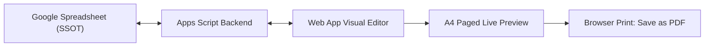

# Panduan Penggunaan — Kalananti SCL Module Generator & Editor

Dokumen ini berisi panduan lengkap mengenai cara kerja, link akses, dan langkah-langkah penggunaan aplikasi **Kalananti SCL Module Generator & Editor**.

---

## 1. Link Akses Aplikasi

> 💡 **PENTING UNTUK TIM ACADEMIC / USER:**
> **Gunakan Link Utama (Live Production)** di bawah ini untuk membuka dan menggunakan Module Generator sehari-hari. Link ini selalu memuat versi kode paling mutakhir yang aktif.

- **🔗 Link Utama (Live Production — Gunakan Ini):**
  [https://script.google.com/macros/s/AKfycbxQg06JEWWWjZ2G9L11vrdyFJ_pSzn1iABGQFWeGrTR/exec](https://script.google.com/macros/s/AKfycbxQg06JEWWWjZ2G9L11vrdyFJ_pSzn1iABGQFWeGrTR/exec)

---

### *Catatan Teknis Mengenai 2 Link:*
Di Google Apps Script terdapat 2 jenis URL:
1. **Link Utama (`@HEAD`):** URL resmi yang otomatis menjalankan kode paling baru setiap kali ada perbaikan atau fitur baru yang diunggah (`clasp push`). **Semua tim cukup menggunakan link ini.**
2. **Link Snapshot / Versioned (`@Version 19`):** URL arsip versi beku (*frozen snapshot*) yang sengaja disimpan sebagai cadangan/rollback jika diperlukan secara teknis. Tim tidak perlu membuka link ini kecuali untuk kebutuhan pengujian versi lama.

---

## 2. Cara Kerja Sistem (Konsep Dasar)

1. **Google Spreadsheet adalah Sumber Data Utama (SSOT):**
   - Semua materi, tugas, dan kuis dibaca dari dan disimpan langsung kembali ke tab sumber (`B2C_RobloxStudio_Modul`, `B2C_Scratch_Modul`, `B2C_Python_Modul`).
2. **Satu Project = Satu Course & Satu Level (12 Session):**
   - Setiap level terdiri dari 12 slot sesi.
3. **Kolaborasi Aman (Locking per Sesi):**
   - Banyak anggota tim dapat bekerja bersamaan di level yang sama, asalkan **mengedit sesi yang berbeda**.
   - Saat Anda membuka sesi, sistem akan mengunci (*lock*) sesi tersebut untuk Anda dan otomatis memperpanjang sewa edit (*heartbeat*) di latar belakang.
   - Saat Anda menekan tombol **"Tutup session"**, lock langsung dilepas seketika sehingga sesi bisa dibuka kembali oleh tim lain.
4. **Autosave Cerdas (Revision-Aware):**
   - Perubahan disimpan otomatis 5 detik setelah Anda berhenti mengetik.
   - Tersedia riwayat revisi (*Revision History*) untuk melihat atau memulihkan versi sebelumnya.
5. **Output Resmi: PDF A4 Melalui Browser Print:**
   - Hasil akhir dirender langsung ke layout A4 presisi tinggi dengan teks yang *selectable* dan grafik SVG yang tajam.

---

## 3. Langkah-Langkah Menggunakan Generator

### Langkah 1: Login ke Aplikasi
1. Buka link aplikasi di browser (Google Chrome direkomendasikan).
2. Masukkan **Team Passcode** yang telah disediakan oleh tim Academic.
3. Masukkan **Nama/Identitas Anda** (contoh: *Yazid Hilmi*).
4. Klik tombol **Masuk**.

---

### Langkah 2: Memilih Course & Level
1. Pada halaman utama (Katalog), pilih salah satu Course:
   - **Roblox Studio**
   - **Scratch**
   - **Python**
2. Pilih nomor **Level** yang ingin dikerjakan (contoh: *Level 1*).
3. Anda akan melihat ringkasan 12 session dan statusnya (*Ready*, *On Progress*, *Needs Fix*, atau *Locked*).

---

### Langkah 3: Mengedit Sesi di Visual Editor
1. Klik kartu session yang ingin Anda edit (misal: *Session 2*).
2. Sesi akan terbuka dalam mode fokus editor:
   - **Panel Kiri:** Editor teks visual (*WYSIWYG*) dengan toolbar formatting (Bold, Italic, List, Heading, Image URL, Table, Page Break).
   - **Panel Kanan:** *Live Preview* A4 real-time yang langsung memperlihatkan hasil cetak halaman buku.
3. **Fitur Pengeditan Khusus:**
   - **Daftar / Bullet List:** Gunakan format `- `, `* `, `• `, atau `✦ ` untuk membuat daftar poin.
   - **Gambar:** Masukkan URL gambar HTTPS publik yang valid (format PNG, WebP, JPEG). Anda dapat mengatur lebar gambar (25%, 50%, 75%, 100%).
   - **Kamus Coder (`kc:`) & For Your Knowledge (`fyk:`):** Gunakan marker kanonis untuk membuat callout card edukatif.
   - **Page Break:** Klik tombol `+ Page break` jika ingin memindahkan materi ke halaman berikutnya secara manual.

---

### Langkah 4: Menyimpan & Menutup Sesi
1. **Autosave:** Begitu Anda berhenti mengetik selama 5 detik, status di pojok kanan atas akan berubah menjadi *"Menyimpan…"* lalu *"Tersimpan"*.
2. **Menutup Sesi:**
   - Setelah selesai mengedit, selalu klik tombol **"Tutup session"** di pojok kanan atas.
   - Tombol ini akan mengamankan draft terakhir ke Spreadsheet dan **seketika melepaskan hak edit (*lock*)**, sehingga rekan tim Anda bisa langsung mengakses sesi tersebut.

---

### Langkah 5: Compose Modul A4 & Cetak PDF
1. Pada tampilan level, klik tombol **"Compose A4 Module"**.
2. Sistem akan menyusun seluruh 12 sesi lengkap dengan:
   - **Hardcover Depan** & **Petunjuk Penggunaan**
   - **Daftar Isi (TOC)** otomatis
   - **Session Opener** (selalu di halaman kiri)
   - **Halaman Isi & Tugas Bertingkat** (*Must Do*, *Should Do*, *Aspire to Do*, *Self-Check*)
   - **Filler Spread** & **Hardcover Belakang**
3. Sistem akan melakukan preflight otomatis untuk memeriksa seluruh URL gambar.
4. Klik tombol **"Print / Save as PDF"**.
5. Pada jendela dialog print browser, atur setting berikut:
   - **Destination:** Save as PDF
   - **Paper Size:** A4
   - **Orientation:** Portrait
   - **Scale:** 100% (Default)
   - **Margins:** None
   - **Options:** Centang **Background graphics** (*Grafik latar belakang*)
6. Klik **Save** dan simpan file PDF modul Anda.

---

## 4. Tips & Best Practices

- **Gunakan Tombol "Tutup Session":** Membiasakan klik tombol ini memastikan Spreadsheet selalu terupdate dan tidak ada lock yang menggantung.
- **Kuis & Kunci Jawaban:** Kolom `quiz_answers` pada Spreadsheet otomatis diisolasi oleh server dan **tidak akan pernah muncul** pada preview siswa atau cetakan PDF.
- **Pemulihan Draft Lokal:** Jika koneksi internet terputus saat mengetik, browser menyimpan draft lokal secara otomatis. Saat membuka kembali sesi tersebut, klik **"Gunakan draft"** untuk melanjutkan pekerjaan Anda.
